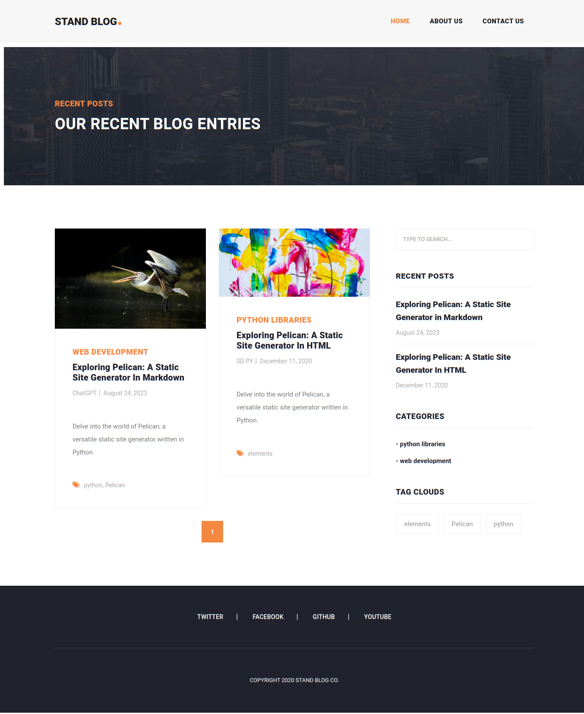

**Stand Bog** is a **Pelican** **responsive**, **clean-coded**, and **optimized mobile devices** Pelican blog theme developed by [**PyPiThemes**](https://pypithemes.com). It works with **GitHub Pages**, **Cloudflare Pages**, and **Netlify Pages** so that you can host it for **free**.

Demo:
-----

Experience the theme in action by visiting our live demo: [Demo](https://stand-blog.pages.dev/)

Features:
---------

*   **Section featured posts:** Showcase your best posts in a dedicated section.
*   **Section Blog:** Display your latest blog posts in a stylish and easy-to-read way.
*   **Section videos:** Share your videos with your readers in a dedicated section.
*   **Section author:** Give your authors their own page to showcase their work.
*   **Section tag:** Organize your posts by tags for easy navigation.
*   **Loading page:** Display a loading animation while your page loads.
*   **Super fast performance:** Stand Bog is optimized for speed and performance so your readers can enjoy your blog without lag.
*   **Social sharing buttons:** Let your readers easily share your posts on social media.
*   **Scroll to the top button:** Easily navigate back to the top of your page with a single click.
*   **Modern search form:** Find the posts you want with a modern and intuitive search form.
*   **Compatible with modern browsers:** Stand Bog is compatible with all modern browsers, so your readers can enjoy your blog regardless of their device.
*   **Image lazy loading:** Only load images when visible on the screen, improving performance.
*   **Image Gallery:** Create beautiful image galleries with ease.
*   **Author page:** Each author has their own page to showcase their work.
*   **Custom logo support:** Upload your own logo to give your blog a unique look.
*   **Supports video posts:** Easily add videos to your posts.
*   **Supports multiple authors:** Easily manage multiple authors with Stand Bog.
*   **Supports contact form (Formspree):** Let your readers easily contact you using a Formspree contact form.
*   **Supports Disqus comments:** Enable Disqus comments on your blog so your readers can discuss your posts.
*   **Supports Google Analytics:** Track your website traffic with Google Analytics.
*   **Ionicons icons:** Use beautiful Ionicons icons throughout your blog.
*   **Free Google Fonts:** Style your blog with over 1,000 free Google Fonts.
*   **Free updates & support:** Stand Bog is constantly updated with new features and bug fixes. You also get free support from the PyPiThemes team.

Technologies:
-------------

*   Pelican==4.8.0
*   Pelican-share-post==1.0.0
*   Bootstrap==v4.1.3
*   Font Awesome==4.3.0